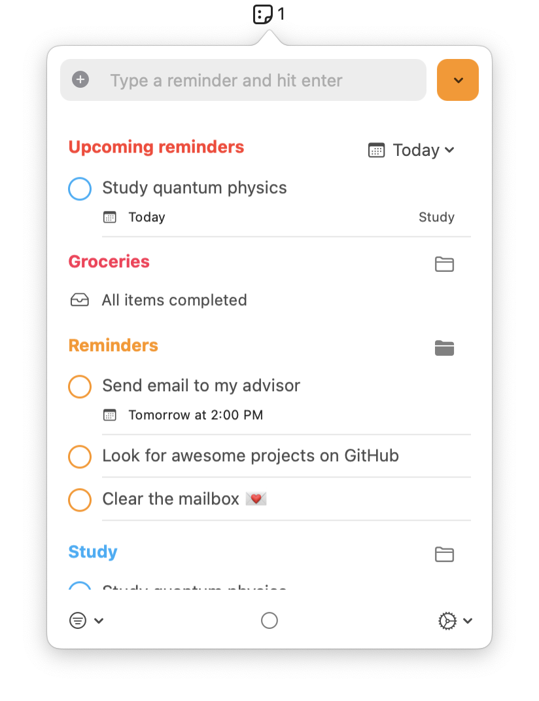
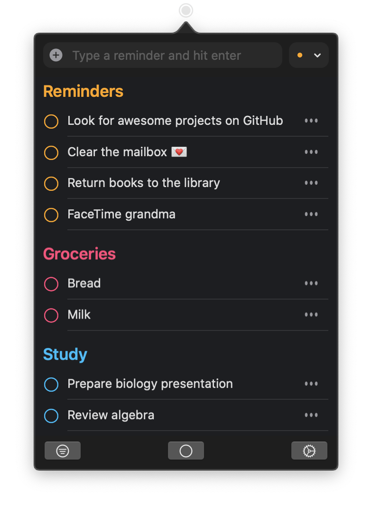
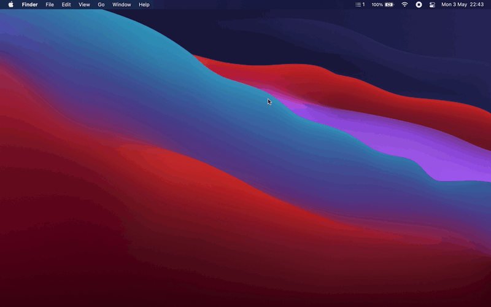
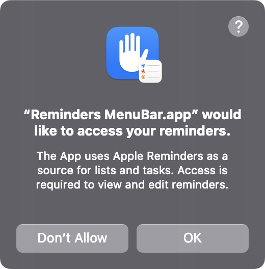

<div align="center">
  
  <h1>
    Reminders MenuBar
  </h1>
  <p>
    Simple macOS menu bar app to view and interact with reminders.
  </p>
  <p>
    <a href="#features">Features</a> •
    <a href="#installation">Installation</a> •
    <a href="#permission-request">Permission Request</a> •
    <a href="#contributing">Contributing</a> •
    <a href="#languages">Languages</a> •
    <a href="#license">License</a>
  </p>
</div>

<div align="center">
  
  
</div>

## Features

* All interactions through the macOS menu bar
* Keep everything in sync with Apple Reminders
* Create new reminders in your chosen list
* Set a reminder's due date using natural language
* Mark reminders as completed / uncompleted
* Edit reminders, Remove reminders or Move reminders between lists
* View a list of upcoming reminders
* Filter reminders through lists or through completed status

<div align="center">
  
</div>

## Installation

*Reminders MenuBar requires macOS Big Sur 11 or later.*

### Homebrew

Reminders MenuBar can be installed using [Homebrew](http://brew.sh).

```bash
brew install --cask reminders-menubar
```

### Direct Download

Direct downloads can be found on the [releases page](https://github.com/DamascenoRafael/reminders-menubar/releases).  
After downloading and extracting, just drag the *.app* file to the *Applications* folder.

## Permission Request

Reminders MenuBar uses [EKEventStore](https://developer.apple.com/documentation/eventkit/ekeventstore) to access reminders on macOS (which are available in Apple Reminders and can be synced through iCloud). On first use, the app should request permission to access reminders as shown below.

<div>
  
</div>

In *System Settings > Privacy & Security > Reminders* it is possible to manage this permission.

### OpenCore Legacy Patcher

If you are using *OpenCore Legacy Patcher* it is possible that you are not being able to grant access permission to reminders and therefore you are facing a window saying *"Access to Reminders is not enabled for Reminders MenuBar"*.

<details>
  <summary>
  Click here if you are using <i>OpenCore Legacy Patcher</i>
  </summary>

This issue is related to *OpenCore Legacy Patcher* as stated in the official documentation:  
[OpenCore Legacy Patcher | Unable to grant special permissions to apps](https://dortania.github.io/OpenCore-Legacy-Patcher/ACCEL.html#unable-to-grant-special-permissions-to-apps-ie-camera-access-to-zoom)

A workaround is to use TCCPlus to add this permission. I would suggest looking up some threads on the subject and if possible making a backup before trying commands that might affect the use of macOS.

I cannot guarantee that TCCPlus still works or if it's reliable for new versions of macOS. The workaround below was tested by other users on issue [#159](https://github.com/DamascenoRafael/reminders-menubar/issues/159), but if you decide to proceed it is at your own risk.

After downloading and extracting [TCCPlus](https://github.com/jslegendre/tccplus) in the *Downloads* folder, open the *Terminal* and run the following commands:

```shell
cd ~/Downloads/
chmod +x tccplus
./tccplus add Reminders br.com.damascenorafael.reminders-menubar
```

</details>

## Contributing

Feel free to share, open issues and contribute to this project! :heart:

## Languages

🇺🇸 English • 🇧🇷 Brazilian Portuguese • 🇨🇳 Chinese (Simplified and Traditional) • 🇳🇱 Dutch • 🇫🇷 French • 🇩🇪 German • 🇮🇹 Italian • 🇯🇵 Japanese • 🇰🇷 Korean • 🇵🇱 Polish • 🇷🇺 Russian • 🇸🇰 Slovak • 🇲🇽 Spanish (Latin America) • 🇹🇷 Turkish • 🇺🇦 Ukrainian • 🇻🇳 Vietnamese

<details>
  <summary>
  Click here to learn how to add new languages :globe_with_meridians:
  </summary>

1. In Project navigator select the project reminders-menubar (first item)
2. In the list of projects and targets select the project reminders-menubar (not the target)
3. In the "Info" tab under "Localizations" select the "+" button and choose the new location
4. In the list of resources, make sure all files are checked and click on "Finish"
5. Edit the new location version of the **Localizable.strings** and **InfoPlist.strings** files with the translations

</details>

## License

This project is licensed under the terms of the GNU General Public License v3.0.  
See [LICENSE](LICENSE) for details.
