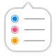
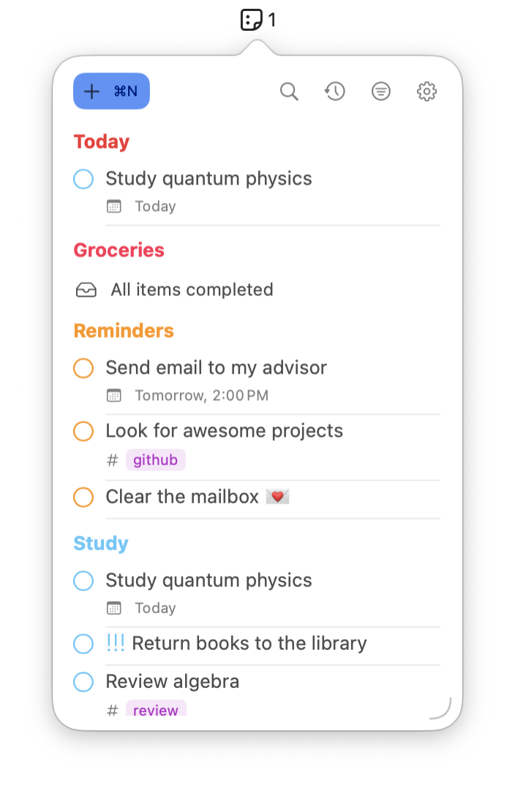
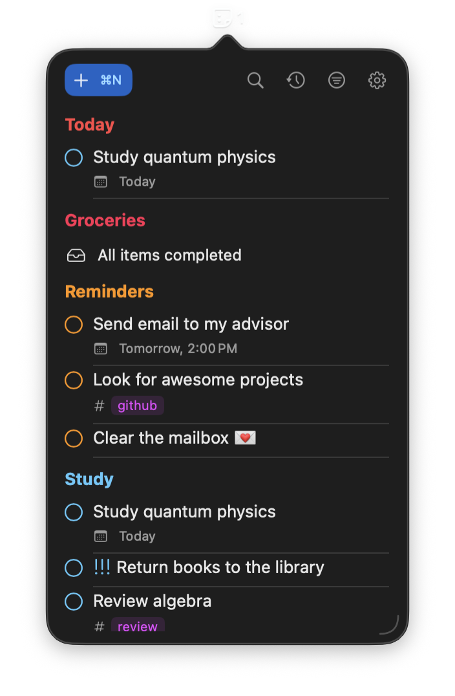
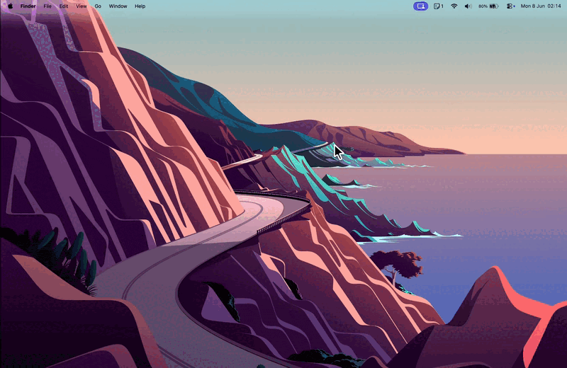
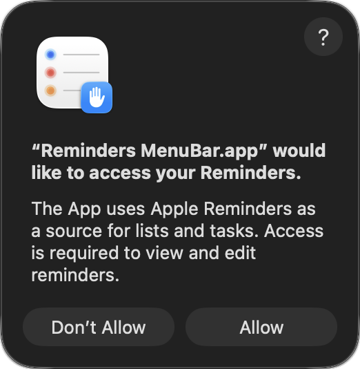

<div align="center">
  
  <h1>
    Reminders MenuBar
  </h1>
  <p>
    Simple macOS menu bar app to view and interact with reminders.
  </p>
  <p>
    <a href="#features">Features</a> •
    <a href="#installation">Installation</a> •
    <a href="#permission-request">Permission Request</a> •
    <a href="#contributing">Contributing</a> •
    <a href="#languages">Languages</a> •
    <a href="#license">License</a>
  </p>
</div>

<div align="center">
  
  
</div>

## Features

* All interactions through the macOS menu bar
* Keep everything in sync with Apple Reminders
* Create new reminders using natural language for due dates, lists, and tags
* Mark as completed or edit due dates, priorities, recurrences, lists, tags, and more
* View upcoming reminders with a configurable time interval
* Search across all your reminders
* Filter reminders through lists and tags
* Customize the menu bar with icon, counter, or next upcoming reminder
* Toggle the app with a global keyboard shortcut

<div align="center">
  
</div>

## Installation

*Reminders MenuBar requires macOS Big Sur 11 or later.*

### Homebrew

Reminders MenuBar can be installed using [Homebrew](https://brew.sh).

```bash
brew install --cask reminders-menubar
```

### Direct Download

Direct downloads are available on the [releases page](https://github.com/DamascenoRafael/reminders-menubar/releases):

* Disk image (`.dmg`): double-click to open, then drag the app to *Applications*
* Zip archive (`.zip`): extract and drag the app to *Applications*

## Permission Request

Reminders MenuBar uses [EKEventStore](https://developer.apple.com/documentation/eventkit/ekeventstore) to access reminders on macOS (which are available in Apple Reminders and can be synced through iCloud). On first use, the app should request permission to access reminders as shown in the image below. Also, in *System Settings > Privacy & Security > Reminders* it is possible to manage this permission. [Click here if you are using *OpenCore Legacy Patcher*](docs/fix-for-opencore-legacy-patcher.md).

<div>
  
</div>

## Contributing

Feel free to share, open issues and contribute to this project! :heart:

## Languages

🇺🇸 English • 🇧🇷 Brazilian Portuguese • 🇨🇳 Chinese (Simplified and Traditional) • 🇨🇿 Czech • 🇳🇱 Dutch • 🇵🇭 Filipino • 🇫🇷 French • 🇩🇪 German • 🇮🇩 Indonesian • 🇮🇹 Italian • 🇯🇵 Japanese • 🇰🇷 Korean • 🇵🇱 Polish • 🇷🇺 Russian • 🇸🇰 Slovak • 🇲🇽 Spanish (Latin America) • 🇹🇷 Turkish • 🇺🇦 Ukrainian • 🇻🇳 Vietnamese

[▶︎ Click here to learn how to add new languages :globe_with_meridians:](docs/adding-new-languages.md)

## License

This project is licensed under the terms of the GNU General Public License v3.0.  
See [LICENSE](LICENSE) for details.
