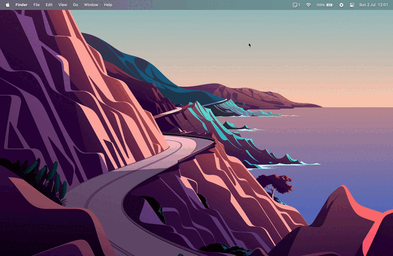

<div align="center">
  
  <h1>
    Reminders MenuBar
  </h1>
  <p>
    Simple macOS menu bar app to view and interact with reminders.
  </p>
  <p>
    <a href="#features">Features</a> •
    <a href="#installation">Installation</a> •
    <a href="#permission-request">Permission Request</a> •
    <a href="#contributing">Contributing</a> •
    <a href="#languages">Languages</a> •
    <a href="#license">License</a>
  </p>
</div>

<div align="center">
  
  
</div>

## Features

* All interactions through the macOS menu bar
* Keep everything in sync with Apple Reminders
* Create new reminders in your chosen list
* Set a reminder's due date using natural language
* Mark reminders as completed / uncompleted
* Edit reminders, Remove reminders or Move reminders between lists
* View a list of upcoming reminders
* Filter reminders through lists or through completed status

<div align="center">
  
</div>

## Installation

*Reminders MenuBar requires macOS Big Sur 11 or later.*

### Homebrew

Reminders MenuBar can be installed using [Homebrew](http://brew.sh).

```bash
brew install --cask reminders-menubar
```

### Direct Download

Direct downloads can be found on the [releases page](https://github.com/DamascenoRafael/reminders-menubar/releases).  
After downloading and extracting, just drag the *.app* file to the *Applications* folder.

## Permission Request

Reminders MenuBar uses [EKEventStore](https://developer.apple.com/documentation/eventkit/ekeventstore) to access reminders on macOS (which are available in Apple Reminders and can be synced through iCloud). On first use, the app should request permission to access reminders as shown in the image below. Also, in *System Settings > Privacy & Security > Reminders* it is possible to manage this permission.

<div>
  
</div>

### OpenCore Legacy Patcher

[▶︎ Click here if you are using *OpenCore Legacy Patcher*](docs/fix-for-opencore-legacy-patcher.md)

## Contributing

Feel free to share, open issues and contribute to this project! :heart:

## Languages

🇺🇸 English • 🇧🇷 Brazilian Portuguese • 🇨🇳 Chinese (Simplified and Traditional) • 🇳🇱 Dutch • 🇫🇷 French • 🇩🇪 German • 🇮🇩 Indonesian • 🇮🇹 Italian • 🇯🇵 Japanese • 🇰🇷 Korean • 🇵🇱 Polish • 🇷🇺 Russian • 🇸🇰 Slovak • 🇲🇽 Spanish (Latin America) • 🇹🇷 Turkish • 🇺🇦 Ukrainian • 🇻🇳 Vietnamese

[▶︎ Click here to learn how to add new languages :globe_with_meridians:](docs/adding-new-languages.md)

## License

This project is licensed under the terms of the GNU General Public License v3.0.  
See [LICENSE](LICENSE) for details.
