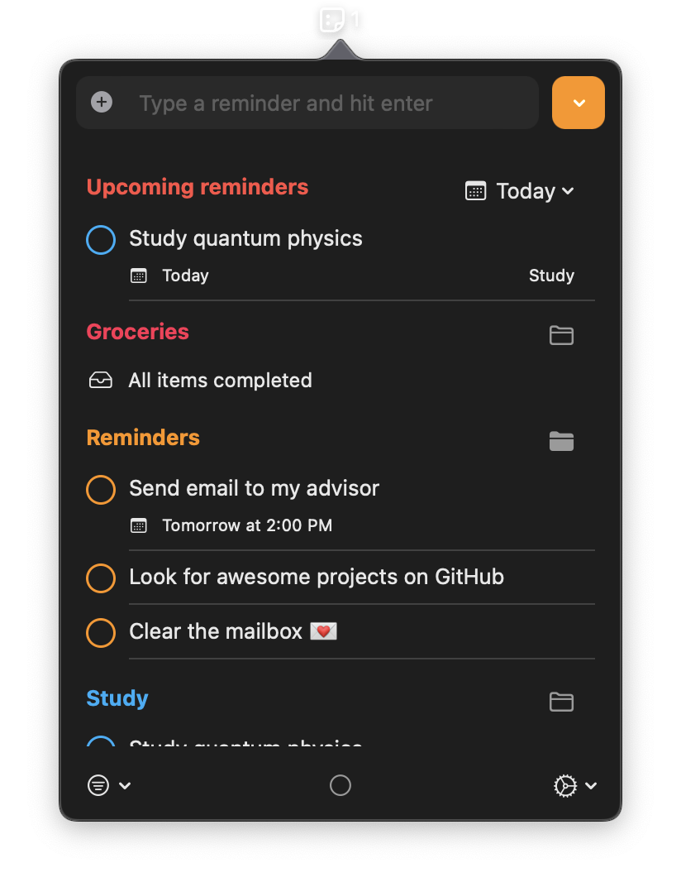

# Reminders Menu Bar

Simple macOS menu bar app to view and interact with reminders.

[Features](#features) •
[Getting Started](#getting-started)

	
	

## Features

* All interactions through the macOS menu bar
* Keep everything in sync with Apple Reminders
* Create new reminders in your chosen list
* Mark reminders as completed / uncompleted
* Remove reminders or Move reminders between lists
* Filter reminders through lists or through completed status

## Getting Started

App requires macOS Big Sur 11 or later.

[[ Instructions coming soon ]]
