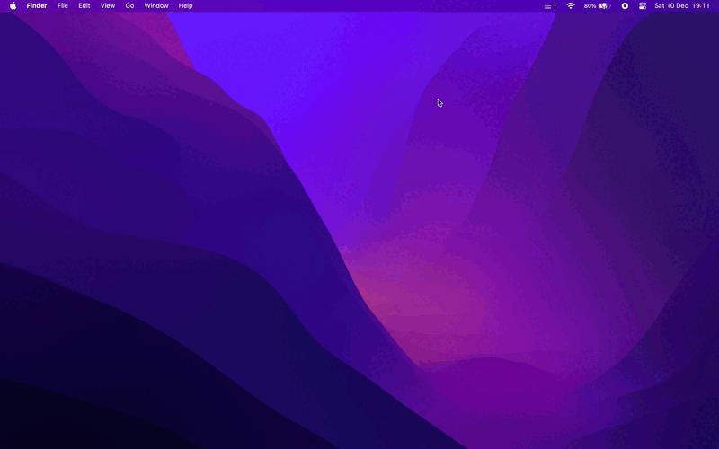

<div align="center">
  
  <h1>
    Reminders Menu Bar
  </h1>
  <p>
    Simple macOS menu bar app to view and interact with reminders.
  </p>
  <p>
    <a href="#features">Features</a> •
    <a href="#installation">Installation</a> •
    <a href="#contributing">Contributing</a> •
    <a href="#languages">Languages</a> •
    <a href="#license">License</a>
  </p>
</div>

<div align="center">
  
  
</div>

## Features

* All interactions through the macOS menu bar
* Keep everything in sync with Apple Reminders
* Create new reminders in your chosen list
* Mark reminders as completed / uncompleted
* Remove reminders or Move reminders between lists
* View a list of upcoming reminders
* Filter reminders through lists or through completed status

<div align="center">
  
</div>

## Installation

*Reminders Menu Bar requires macOS Big Sur 11 or later.*

**Note**: The app is not signed by an account enrolled in the Apple Developer Program; As a result you will probably see a message saying it cannot be opened since it is not from an Identified Developer.  
See [Apple Support: Open a Mac app from an unidentified developer](https://support.apple.com/guide/mac-help/mh40616/mac).

<details>
  <summary>
  Click here to learn how to open an app from an unidentified developer
  </summary>

  1. Try to run the app and when you see the message just click *OK*;
  2. Open *System Preferences* > *Security and Privacy*;
  3. On the *General* tab check the message saying that the app was blocked;
  4. Finally click on *Open Anyway*.

</details>

### Homebrew

Reminders Menu Bar can be installed using [Homebrew](http://brew.sh).

```bash
brew install --cask DamascenoRafael/tap/reminders-menubar
```

### Direct Download

Direct downloads can be found on the [releases page](https://github.com/DamascenoRafael/reminders-menubar/releases).  
After downloading and extracting, just drag the *.app* file to the *Applications* folder.

## Contributing

Feel free to share, open issues and contribute to this project! :heart:

## Languages

🇺🇸 English • 🇧🇷 Brazilian Portuguese • 🇮🇹 Italian

<details>
  <summary>
  Click here to learn how to add new languages :globe_with_meridians:
  </summary>

1. In Project navigator select the project reminders-menu-bar (first item)
2. In the list of projects and targets select the project reminders-menu-bar (not the target)
3. In the "Info" tab under "Localizations" select the "+" button and choose the new location
4. In the list of resources, make sure all files are checked and click on "Finish"
5. Edit the new location version of the **Localizable.strings** and **InfoPlist.strings** files with the translations

</details>

## License

This project is licensed under the terms of the GNU General Public License v3.0.  
See [LICENSE](LICENSE) for details.
