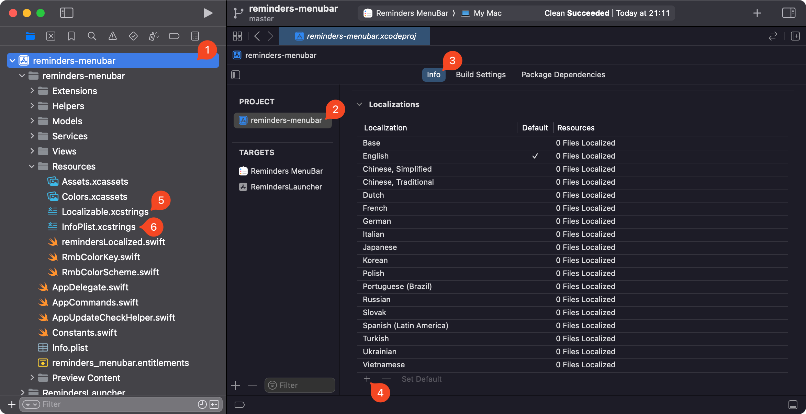

# Adding new languages :globe_with_meridians:

Download the repository and open **reminders-menubar.xcodeproj** in Xcode.

1. In Project navigator select the project *reminders-menubar*
2. In the list of projects and targets select the project *reminders-menubar*
3. In the opened panel select the "Info" tab
4. Under "Localizations" select the "+" button and choose the new location
5. Edit the new location in the **Localizable.xcstrings** file with the translations
6. Edit the new location in the **InfoPlist.xcstrings** file with the translations

